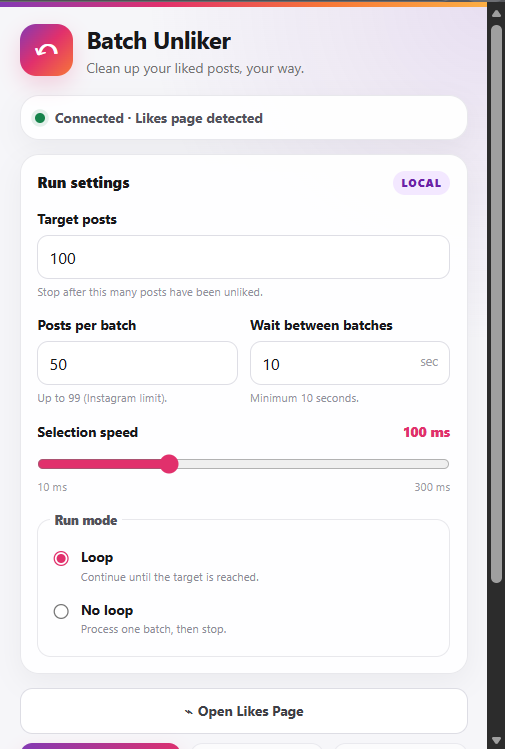
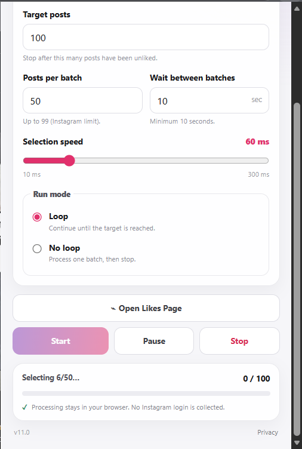
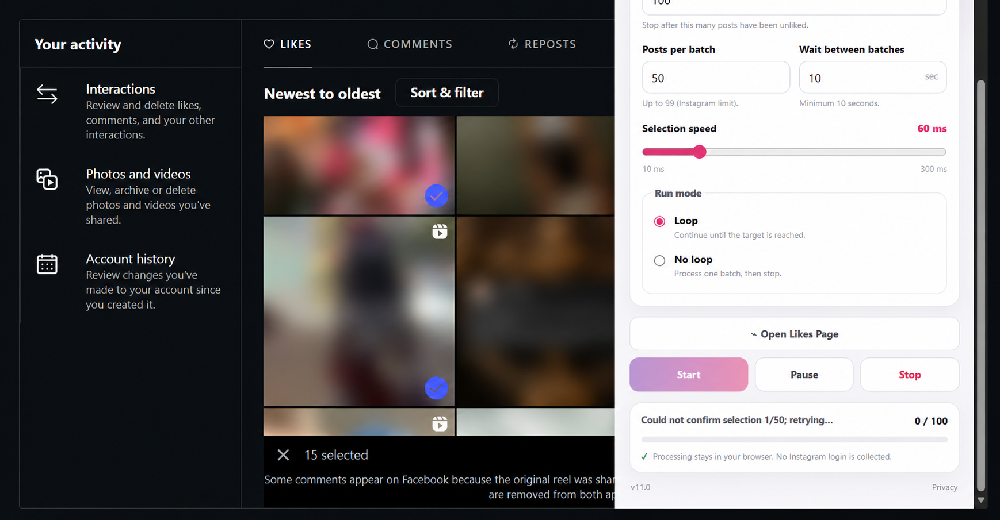
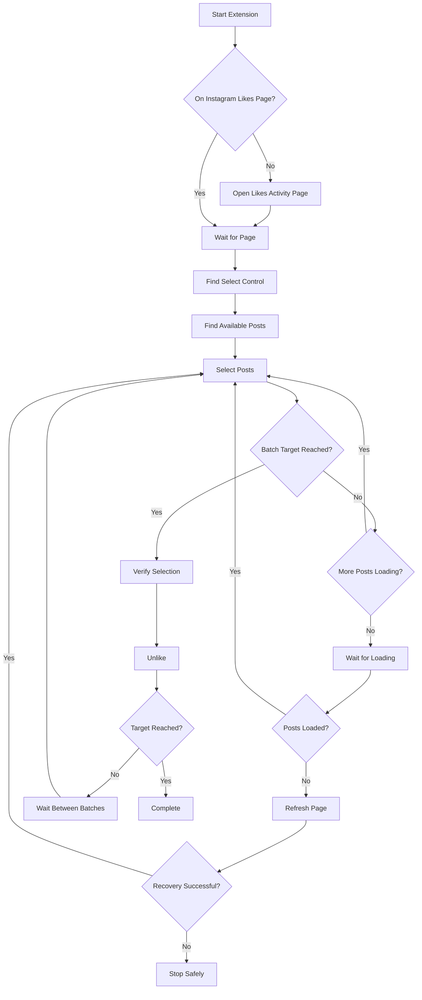
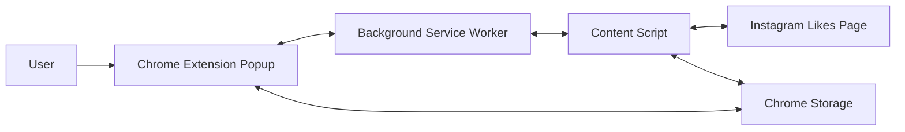

<p align="center">
  
</p>

<h1 align="center">Instagram Batch Unliker</h1>

<p align="center">
  <strong>Batch-manage your Instagram liked posts with speed, control, and recovery built in.</strong>
</p>

<p align="center">
  <a href="#-features">Features</a> •
  <a href="#-installation">Installation</a> •
  <a href="#-how-it-works">How It Works</a> •
  <a href="#-safety--reliability">Safety</a> •
  <a href="#-troubleshooting">Troubleshooting</a> •
  <a href="#-disclaimer--terms-of-use">Disclaimer</a>
</p>

<p align="center">


</p>

---

## ✨ What is Instagram Batch Unliker?

**Instagram Batch Unliker** is a browser extension designed to make it easier to manage large numbers of posts from Instagram's **Likes activity page**.

Instead of manually opening and unliking posts one by one, the extension works with Instagram's existing multi-selection interface and lets you control:

- 🎯 How many posts to process
- 📦 How many posts to select per batch
- ⚡ How quickly posts are selected
- ⏱️ How long to wait between batches
- ⏸️ When to pause
- ▶️ When to resume
- 🛑 When to completely stop and reset
- 🔁 Whether to continue automatically
- ♻️ What to do if Instagram stops loading additional posts

The extension does **not** require your Instagram password.

---

> [!WARNING]
> **Use this extension at your own risk.**
>
> Browser automation can potentially trigger Instagram's anti-abuse systems, rate limits, restrictions, or other account actions. The developer does **not** guarantee that your Instagram account will remain unrestricted, unaffected, or available while using this software.
>
> **You are responsible for deciding whether using automation on your account is appropriate.**

---

## 📸 Preview

> Add your screenshots to `assets/` using the filenames below.

<p align="center">
  
  &nbsp;&nbsp;
  
</p>

<p align="center">
  
</p>

---

## 🚀 Features

| Feature | Description |
|---|---|
| 🎯 **Target Posts** | Choose how many posts you want to process |
| 📦 **Batch Size** | Process up to **99 posts per batch** |
| ⚡ **Selection Speed** | Adjustable from **10 ms to 300 ms** |
| ⏱️ **Batch Delay** | Configure the wait between batches |
| ▶️ **Pause / Resume** | Temporarily pause without resetting progress |
| 🛑 **Stop & Reset** | Completely terminate the current run and reset progress |
| 🔁 **Loop Mode** | Continue processing batches automatically |
| 📊 **Live Progress** | Track processed posts in real time |
| 🔄 **Automatic Likes Page** | Opens the Instagram Likes activity page when needed |
| ♻️ **Stall Recovery** | Detects when additional posts stop loading |
| 🔃 **Automatic Refresh** | Attempts to recover a stalled Likes page |
| 💾 **Persistent State** | Preserves relevant run state across supported page reloads |
| 🔐 **No Password Collection** | The extension does not ask for your Instagram password |
| 🌐 **Local Browser Operation** | Processing occurs in the browser rather than through a developer-operated automation server |

---

# 📥 Installation

## Option 1 — Load the extension manually

This is the recommended method for development/testing.

### 1. Download the repository

```bash
git clone https://github.com/YOUR_USERNAME/instagram-batch-unliker.git
```

Or use:

**Code → Download ZIP**

### 2. Extract the repository

Extract the ZIP somewhere on your computer.

You should have a folder containing:

```text
instagram-batch-unliker/
├── icons/
├── background.js
├── content.js
├── manifest.json
├── popup.html
├── popup.css
├── popup.js
├── privacy.html
├── README.md
└── ...
```

### 3. Open Chrome extensions

Go to:

```text
chrome://extensions/
```

### 4. Enable Developer Mode

Turn on:

> **Developer mode**

### 5. Load the extension

Click:

> **Load unpacked**

Select the extracted project folder containing `manifest.json`.

### 6. Pin the extension

Click the puzzle-piece icon in Chrome and pin:

> **Instagram Batch Unliker**

---

# 🎛️ Configuration

After installing the extension, open it from the Chrome toolbar.

You'll see several controls.

## 🎯 Target Posts

Defines approximately how many posts the automation should process during the run.

Example:

```text
Target Posts: 500
```

The extension continues processing batches until the target is reached or the run is stopped.

---

## 📦 Posts Per Batch

Controls how many posts Instagram should select before the extension presses **Unlike**.

Current maximum:

```text
99 posts
```

Example:

```text
Batch Size: 40
```

The extension attempts to select 40 posts, then performs the Unlike action for that batch.

---

## ⚡ Selection Speed

Controls the delay between individual post selections.

Current range:

```text
10 ms ─────────────── 300 ms
```

Examples:

| Setting | Behavior |
|---:|---|
| `10 ms` | Extremely fast |
| `30 ms` | Very fast |
| `50 ms` | Fast |
| `100 ms` | Moderate |
| `200 ms` | Slower |
| `300 ms` | Conservative |

### Recommended starting point

Try:

```text
50–100 ms
```

If Instagram misses selections at very low values, increase the delay.

> [!TIP]
> A faster interval does **not** necessarily mean better results. If Instagram's interface cannot process clicks quickly enough, an extremely low interval may result in missed selections.

---

## ⏱️ Wait Between Batches

Controls how long the extension waits after completing a batch before starting another one.

This can be useful when processing a large number of posts.

For example:

```text
Batch Size: 40
Wait: 30 seconds
```

The extension will approximately:

```text
Select 40
     ↓
Unlike
     ↓
Wait 30 seconds
     ↓
Select next batch
     ↓
Unlike
     ↓
...
```

---

## 🔁 Loop Mode

### Loop ON

The extension continues processing batches automatically until:

- The target is reached
- You press Stop
- The extension encounters an unrecoverable condition

### Loop OFF

The extension stops after completing the requested operation.

---

# ▶️ Pause, Resume & Stop

These controls deliberately have different meanings.

## ⏸️ Pause

Pause temporarily.

Progress is retained.

Example:

```text
Processed: 120 / 500

        ↓ Pause

Processed: 120 / 500

        ↓ Resume

Continues from the current run
```

Changing settings while paused is supported.

For example:

```text
Pause
 ↓
Change Batch Size: 40 → 60
 ↓
Change Selection Speed
 ↓
Resume
```

The existing run continues instead of starting a duplicate automation loop.

---

# 🛑 Stop

**Stop is intentionally different from Pause.**

Pressing Stop means:

> **Terminate this run completely.**

The extension resets:

- Current run state
- Processed counter
- Batch state
- Selection state
- Recovery state
- Active run identifier

If Instagram is currently in multi-selection mode, the extension attempts to exit that selection state before terminating.

The next time you press Start, it begins a **fresh run**.

```text
RUNNING
   │
   │ Stop
   ▼
RESET
   │
   │ Start
   ▼
NEW RUN
```

---

# 🧠 How It Works

Instagram already provides a multi-selection interface on the Likes activity page.

The extension interacts with that existing interface rather than attempting to directly modify Instagram's backend.

### Simplified flow



---

# 🔄 Automatic Page Recovery

Instagram may occasionally stop loading additional posts while scrolling through a large Likes history.

The extension includes recovery logic for this situation.

### Recovery process

```text
Posts stop appearing
        ↓
Wait for additional loading
        ↓
Still no new posts?
        ↓
Refresh Instagram Likes page
        ↓
Restore the active run
        ↓
Continue processing
```

The extension does not endlessly refresh the page.

If recovery repeatedly fails, the run is stopped rather than blindly continuing.

---

# 🛡️ Safety & Reliability

The extension includes several safeguards intended to reduce accidental or uncontrolled behavior.

## 1. No Instagram password

The extension does not ask you to enter:

```text
Instagram username
Instagram password
2FA code
```

Authentication remains handled by your browser's existing Instagram session.

---

## 2. No developer-operated automation server

The extension is designed to operate inside the browser.

There is no requirement to send your Instagram session to a remote automation server operated by the developer.

---

## 3. Batch limits

The extension intentionally operates in batches instead of attempting to process an unlimited number of posts in a single selection.

Current maximum:

```text
99 posts / batch
```

---

## 4. Pause control

You can interrupt an active run without intentionally resetting the overall run state.

---

## 5. Hard Stop

Stop is designed as a complete reset.

This helps prevent an old asynchronous operation from unexpectedly continuing after the user has decided to terminate the run.

---

## 6. Run isolation

Each active run has its own execution identity.

When a run is stopped, previous asynchronous operations are invalidated so they cannot continue controlling the page as a new run begins.

---

## 7. Selection verification

The extension attempts to verify that Instagram's selection state is changing before continuing.

This is important because a browser click event does not automatically guarantee that Instagram accepted the action.

---

## 8. Stall detection

The extension watches for situations where additional posts stop appearing.

Instead of continuously clicking against a stale page, it waits and enters recovery when necessary.

---

## 9. Safe failure

When the extension cannot reliably continue, it is designed to stop rather than blindly assume that an operation succeeded.

---

# 🔐 Privacy

Instagram Batch Unliker is designed around local browser operation.

The extension does not require users to provide their Instagram password to the extension.

The extension's privacy policy is available here:

**[Privacy Policy](./privacy.html)**

### Data principle

The project follows a simple principle:

> **Only access what is required for the extension's stated purpose.**

The extension interacts with the Instagram Likes activity page because that is where the user performs the intended action.

---

# 🧩 Project Structure

```text
instagram-batch-unliker/
│
├── icons/
│   ├── icon16.png
│   ├── icon32.png
│   ├── icon48.png
│   └── icon128.png
│
├── background.js
│   └── Extension background/service-worker logic
│
├── content.js
│   └── Instagram page interaction and automation engine
│
├── popup.html
│   └── Extension interface
│
├── popup.css
│   └── UI styling
│
├── popup.js
│   └── Popup controls and extension state communication
│
├── manifest.json
│   └── Chrome extension configuration
│
├── privacy.html
│   └── Privacy policy
│
└── README.md
    └── Project documentation
```

---

# 🔧 Technical Architecture



### Popup

Responsible for:

- User controls
- Settings
- Progress display
- Pause/Resume/Stop controls
- Connection state

### Background Service Worker

Responsible for:

- Active-tab communication
- Opening the Likes page
- Routing commands between the popup and content script

### Content Script

Responsible for:

- Detecting Instagram's controls
- Selecting posts
- Scrolling
- Verifying selection
- Triggering Unlike
- Detecting stalls
- Recovery behavior
- Run state

### Chrome Storage

Used for relevant extension settings and state persistence.

---

# ⚙️ Requirements

- Google Chrome or another Chromium-based browser supporting Manifest V3
- An Instagram account
- Access to Instagram's Likes activity page
- JavaScript enabled
- A desktop browser environment

The extension is intended for Chromium-based browsers and is not a mobile application.

---

# 🧪 Recommended Settings

For a first test, use a small target.

### Conservative

```text
Target:           20
Batch Size:       10
Selection Speed:  100 ms
Batch Wait:       30 sec
Loop:             OFF
```

### Faster

```text
Target:           100
Batch Size:       40
Selection Speed:  50 ms
Batch Wait:       30 sec
Loop:             ON
```

### Maximum batch

```text
Batch Size:       99
Selection Speed:  50–100 ms
```

> [!IMPORTANT]
> Start with a small target and verify that Instagram is correctly registering selections before processing a large number of posts.

---

# 🐛 Troubleshooting

## "It only selected some of my requested posts."

Try increasing the selection interval.

For example:

```text
10 ms → 50 ms → 100 ms
```

Very aggressive intervals may cause Instagram's UI to miss interactions.

---

## "The page stopped loading posts."

The extension has stall-recovery logic.

It waits for additional posts and can refresh the Likes page if the page appears stalled.

If repeated recovery attempts fail, the run may stop rather than continuing blindly.

---

## "I paused and Resume doesn't continue."

Make sure you're using **Pause**, not Stop.

Pause is designed to preserve the current run.

Stop intentionally destroys the current run and starts fresh when Start is pressed again.

---

## "I pressed Stop and want to start again."

That's expected behavior.

Stop performs a complete reset.

Press Start again to begin a new run.

---

## "Instagram's UI changed."

Instagram frequently changes its frontend.

This extension relies on elements and visible controls exposed by the Instagram Likes activity interface. Changes to Instagram's UI may therefore break some functionality.

If you find a reproducible issue, please open an issue with:

- Browser version
- Extension version
- What happened
- What you expected
- Relevant screenshot
- Console error, if available

**Never post your Instagram password, session cookies, access tokens, or private account information in an issue.**

---

# 📋 Known Limitations

This project depends on Instagram's current web interface.

Therefore:

- Instagram UI changes can break selectors.
- Instagram may change or remove the Likes activity interface.
- Network conditions can affect loading.
- Browser performance can affect selection timing.
- Very aggressive selection speeds may result in missed interactions.
- Instagram may impose its own rate limits or restrictions.
- The extension cannot guarantee that every click will be accepted by Instagram.
- The extension cannot guarantee uninterrupted operation for extremely large histories.

---

# 🚨 Account & Platform Risk

This section is intentionally explicit.

Instagram Batch Unliker interacts with Instagram's web interface automatically.

Automation may be treated differently from normal manual interaction by Instagram or other services.

Possible consequences are outside the developer's control and may include:

- Temporary action restrictions
- Rate limiting
- Additional verification
- Login challenges
- Session interruption
- Feature restrictions
- Account restrictions
- Other platform enforcement

**The developer does not guarantee that use of this software will be consequence-free.**

If you are uncomfortable with these risks, **do not use the extension on your account.**

---

# 📜 Disclaimer & Terms of Use

By installing, modifying, or using this software, you acknowledge and agree to the following.

## 1. Use at your own risk

This software is provided as an independent open-source project.

You use it entirely at your own risk.

The developer is not responsible for consequences resulting from your use of the software.

---

## 2. Account responsibility

The developer is **not responsible for any action taken against your Instagram account**, including but not limited to:

- Account suspension
- Account restriction
- Temporary blocks
- Feature limitations
- Login challenges
- Verification requests
- Loss of access
- Deleted or modified content
- Any other account-related consequence

You are solely responsible for deciding whether to use the software with your account.

---

## 3. No guarantee

The software is provided **"AS IS" and "AS AVAILABLE"**, without warranties of any kind, express or implied.

The developer does not guarantee:

- Continuous operation
- Compatibility with future Instagram versions
- Successful processing of every post
- A specific processing speed
- Error-free operation
- Availability of Instagram's Likes interface
- Compatibility with every Chromium-based browser

---

## 4. Instagram / Meta relationship

**Instagram Batch Unliker is an independent third-party project.**

It is:

- Not owned by Instagram
- Not operated by Instagram
- Not sponsored by Instagram
- Not endorsed by Instagram
- Not affiliated with Meta Platforms, Inc.

Instagram and Meta are trademarks of their respective owners.

---

## 5. Platform terms

Users are responsible for reviewing and complying with the terms, policies, and rules applicable to their Instagram account and use of Instagram.

This project does not grant permission to bypass platform restrictions or security mechanisms.

---

## 6. No credential sharing

Never provide your Instagram password, authentication codes, session cookies, access tokens, or other credentials to this project.

---

## 7. No abuse

Do not use this software to:

- Attack Instagram
- Bypass security controls
- Circumvent authentication
- Access accounts you do not own
- Automate unauthorized activity
- Interfere with other users

---

# 🔒 Security

If you discover a security vulnerability, **do not publish sensitive exploit details in a public issue**.

Instead, contact the repository maintainer privately through the contact method listed in the repository profile.

Never submit:

```text
Passwords
Session cookies
Access tokens
Private account data
Authentication codes
```

in GitHub issues or pull requests.

---

# 🤝 Contributing

Contributions are welcome.

Before opening a pull request:

1. Fork the repository.
2. Create a feature branch.
3. Make your changes.
4. Test the extension locally.
5. Verify that the extension still loads correctly.
6. Test Pause / Resume / Stop behavior.
7. Test batch processing.
8. Test recovery behavior.
9. Open a pull request with a clear description.

Example:

```bash
git checkout -b feature/improved-recovery
```

Then:

```bash
git add .
git commit -m "Improve page recovery"
git push origin feature/improved-recovery
```

---

# 💡 Feature Requests & Bug Reports

Found something broken?

Please open an issue and include:

```text
Browser:
Chrome version:
Extension version:
Operating system:

Expected behavior:
Actual behavior:

Steps to reproduce:
1.
2.
3.
```

Screenshots and short screen recordings are especially useful.

**Do not include private Instagram information.**

---

# 🗺️ Roadmap

Potential future improvements include:

- [ ] More robust Instagram UI detection
- [ ] Improved loading-state detection
- [ ] Additional recovery strategies
- [ ] Better accessibility
- [ ] More detailed progress reporting
- [ ] Additional Chromium browser testing
- [ ] Automated regression tests for extension logic
- [ ] Improved diagnostics for failed selections

Features may change as Instagram changes its interface.

---

# 📦 Versioning

The project uses semantic-style versioning:

```text
MAJOR.MINOR.PATCH
```

For example:

```text
12.3.0
```

Where:

- **MAJOR** = significant architecture or behavior changes
- **MINOR** = new functionality
- **PATCH** = bug fixes and small improvements

---

# 🧑‍💻 Development

The extension intentionally uses a lightweight architecture without a large frontend framework.

Main technologies:

- JavaScript
- HTML
- CSS
- Chrome Extension Manifest V3
- Chrome Storage API
- Chrome Tabs API
- Content Scripts

No external JavaScript libraries are required for the core extension.

---

# 📄 License

This project is licensed under the **MIT License**.

See [`LICENSE`](./LICENSE) for the complete license text.

> [!NOTE]
> If you publish this repository under a different license, replace this section with the license you actually choose.

---

# ❤️ Support the Project

If this project is useful to you:

⭐ Star the repository

🐛 Report reproducible bugs

💡 Suggest improvements

🔧 Submit pull requests

📖 Improve the documentation

Sharing the project is also appreciated.

---

# ⚠️ Final Reminder

**This is an automation tool, not an official Instagram feature.**

Before using it on an important account:

1. Understand the risks.
2. Start with a small target.
3. Use a reasonable selection interval.
4. Monitor the first few batches.
5. Stop immediately if Instagram behaves unexpectedly.

**You control your account. You control whether this software is used.**

The developer provides the software but accepts no responsibility for consequences resulting from its use.

---

<p align="center">

<strong>Built for controlled, transparent browser automation.</strong>

<br><br>


<br>

<sub>Instagram Batch Unliker • Independent Open-Source Project</sub>

</p>
